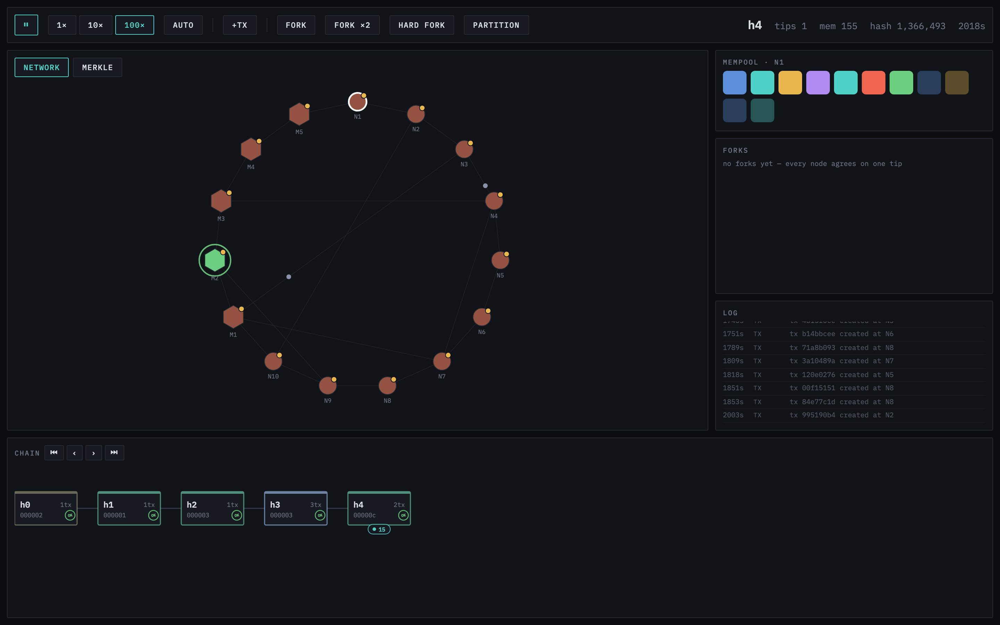

# Blockchain Simulator

Watch a small Bitcoin-style network mine real blocks, spread them, and fight over forks — live, in your browser.

No signup. No backend. Nothing to read before you start — just press play and watch.



---

## Run it

```
bun install
bun run dev
```

Open the link it prints (usually `http://localhost:5173`).

---

## What you're looking at

The screen has four parts.

**Network** (top left) — 15 computers ("nodes"). The hexagons are **miners**. The circles are regular **nodes** that just relay data. Click any of them to see what it knows.

**Mempool** (top right) — transactions waiting to get into a block, for whichever node you last clicked.

**Chain** (bottom) — every block ever mined, left to right. This is the actual blockchain.

**Merkle** (a tab next to Network) — one block's transactions, hashed into a tree. Hover a leaf to see its proof.

---

## How mining works here

Every ~6 seconds (at 100× speed), a miner finds a valid hash and creates a new block. That part is **real** — genuine SHA-256 hashing, running in the background, not simulated. The only shortcut: the difficulty is set low on purpose, so your laptop can solve it in seconds instead of years.

- **Click a miner** to see its stats and its history of mining attempts.
- **Click a block** to open it up — see its hash, nonce, and transactions. You can even edit the nonce and try to "re-mine" it yourself.
- A block gets a green **seal** once it's valid. Tamper with it, and the seal turns red.

---

## Why blocks sometimes split

Two miners can solve a block at nearly the same time. When that happens, the network briefly disagrees — you'll see two colors spreading from different nodes. This is a **fork**.

It resolves itself: the next block extends one side, that side becomes longer, and every node switches to it. This is exactly how Bitcoin resolves forks in real life.

You can also trigger it on purpose:

| Button | What it does |
|---|---|
| **Fork** | Has two miners solve the same height within propagation latency — the first announces, the second finds its own before that block reaches it — guaranteeing a fork you can watch resolve. |
| **Partition** | Cuts the network in half. Each half keeps mining, unaware of the other. |
| **Heal** | Reconnects the network. Whichever half fell behind does a **reorg** — it throws away its blocks and adopts the winning chain. |

---

## Controls

| Control | Effect |
|---|---|
| ▶ / ⏸ | Run or pause the simulation |
| 1× / 10× / 100× | Simulation speed |
| Auto / Manual | Auto generates transactions and mines by itself. Manual waits for you. |
| +TX | Create a random transaction |

---

## The honest simplifications

This is a teaching tool, not a Bitcoin clone. Two things are simplified on purpose:

1. **Difficulty is low.** Real Bitcoin mining takes ~10 minutes per block on specialized hardware. This simulator solves one in seconds so you don't have to wait.
2. **No signatures.** Real transactions are cryptographically signed. Here, a transaction is valid if it doesn't double-spend and the numbers add up — signatures are left out to keep the code readable.

Everything else — hashing, the mempool, the UTXO set, propagation, forks, reorgs — works the same way it does in the real network.
